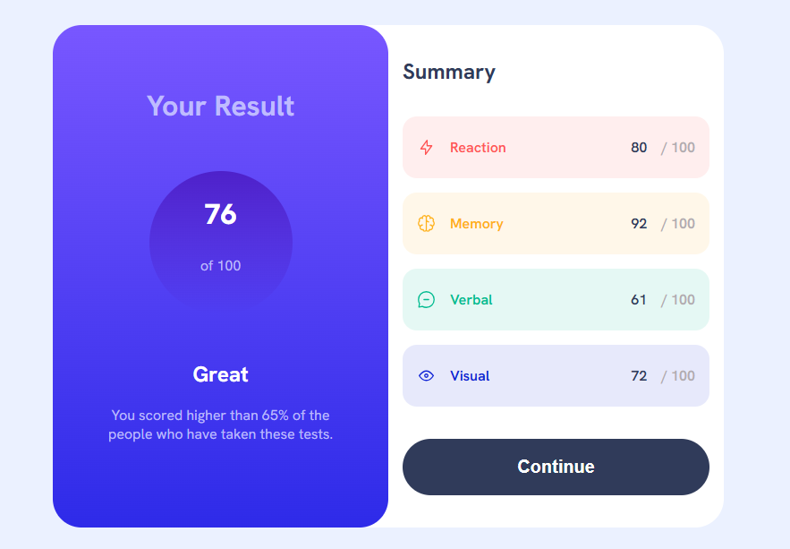

# Frontend Mentor - Results summary component solution

This is a solution to the [Results summary component challenge on Frontend Mentor](https://www.frontendmentor.io/challenges/results-summary-component-CE_K6s0maV). Frontend Mentor challenges help you improve your coding skills by building realistic projects. 

## Table of contents

- [Overview](#overview)
  - [The challenge](#the-challenge)
  - [Screenshot](#screenshot)
  - [Links](#links)
- [My process](#my-process)
  - [Built with](#built-with)
  - [What I learned](#what-i-learned)
  - [Continued development](#continued-development)
  - [Useful resources](#useful-resources)
  - [AI Collaboration](#ai-collaboration)


## Overview

### The challenge

Users should be able to:

- View the optimal layout for the interface depending on their device's screen size
- See hover and focus states for all interactive elements on the page
- **Bonus**: Use the local JSON data to dynamically populate the content

### Screenshot



### Links

- Live Site URL: [Result summary component](https://somaia02.github.io/results-summary-component-main/)

## My process

### Built with

- Semantic HTML5 markup
- CSS custom properties
- Flexbox
- CSS Grid
- Mobile-first workflow
- [React](https://reactjs.org/) - JS library


### What I learned

I learned about fetching data with `useEffect` and creating custom hooks.

```jsx
const data = useData('../data.json');
```

I learned how to make a transition for the hover effect when using gradient backgrounds.
```css
.continue-btn {
  background: var(--dark-gray-blue);
  position: relative;
  isolation: isolate;
  &:hover::before {
    opacity: 1;
  }
}
.continue-btn::before {
  content: "";
  position: absolute;
  inset: 0;
  opacity: 0;
  border-radius: 100vw;
  z-index: -1;
  background: linear-gradient(var(--light-slate-blue-bg), var(--light-royal-blue-bg));
  transition: 200ms ease-in-out;
}
```

### Continued development

I used vite to scaffold the project. I did some research to understand what each file is for and how things work together but I feel like I need some time to fully understand this.

### Useful resources

- [Fetching data with `useEffect`](https://react.dev/reference/react/useEffect#fetching-data-with-effects) - This helped me learn how to fetch data in react.


### AI Collaboration

I used Gemini for debugging and explaining some concepts. Used Copilot for explaining concepts and coming up with solutions.
